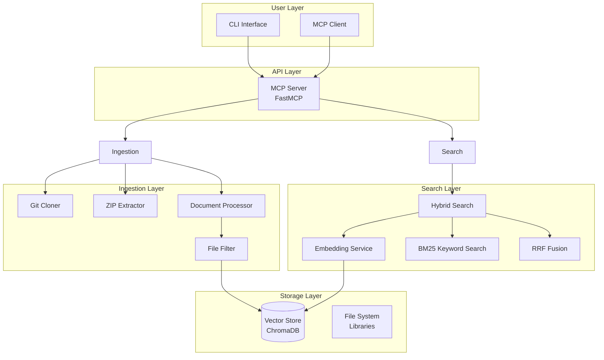
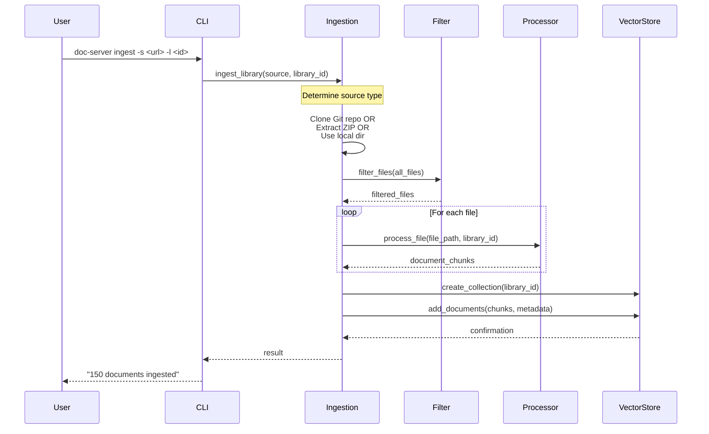
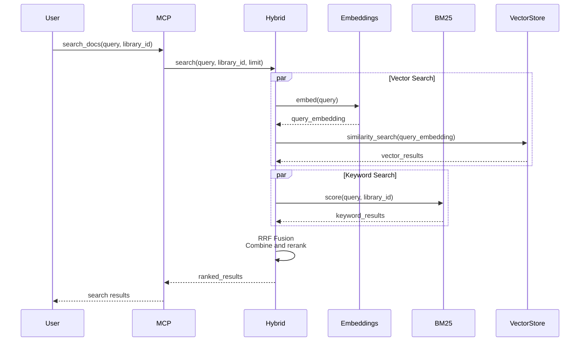
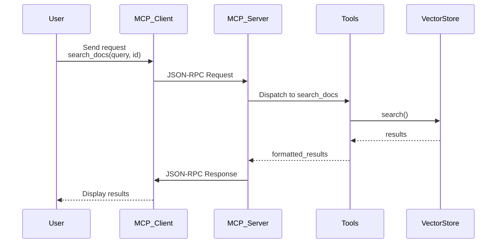

# Architecture Overview

This document describes the high-level architecture and data flows of Doc Server.

## System Architecture



## Components

### Ingestion Layer

Responsible for acquiring and processing documentation:

- **Git Cloner**: Shallow clones Git repositories with metadata extraction
- **ZIP Extractor**: Extracts ZIP archives with security validation
- **File Filter**: Filters files using `.gitignore` patterns and allowlists
- **Document Processor**: Extracts content, chunks documents, handles encodings

### Search Layer

Provides hybrid search capabilities:

- **Embedding Service**: Generates semantic embeddings using sentence-transformers
- **BM25 Scorer**: Performs keyword-based scoring using BM25 algorithm
- **RRF Fusion**: Combines vector and keyword results using Reciprocal Rank Fusion

### Storage Layer

Persists data for retrieval:

- **Vector Store**: ChromaDB for storing embeddings and metadata
- **File System**: Stores source documentation for reference

### API Layer

Provides external interfaces:

- **CLI**: Command-line interface using Click
- **MCP Server**: Model Context Protocol server using FastMCP

## Data Flow: Ingestion



## Data Flow: Search



## Data Flow: MCP Communication



## Library ID Format

Libraries are identified using path-based identifiers:

- `/pandas` - Main pandas library
- `/pandas/v2.2` - Version-specific identifier
- Case-insensitive matching

## Storage Structure

```
~/.doc-server/
├── chroma.db/          # ChromaDB database
├── models/             # Downloaded embedding models
├── libraries/          # Ingested source data
└── config.yaml         # User configuration
```

## Next Steps

- See the [CLI Reference](cli.md) for usage
- Learn about [MCP Tools](mcp-tools.md)
- Read the [Configuration](configuration.md) guide
- Explore [Examples](examples.md)
