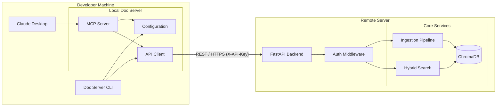

# Remote Backend Design Specification

## 1. Architecture Overview

The Remote Backend architecture splits the monolithic Doc Server into two logical components:
1.  **Client**: Lightweight MCP server or CLI that communicates via REST.
2.  **Backend**: Heavyweight server hosting the Vector DB, Embedding Model, and Ingestion Pipeline.

### System Diagram



## 2. API Design

The backend will expose a RESTful API using **FastAPI**. All endpoints will be prefixed with `/api/v1`.

### Authentication
- **Mechanism**: API Key
- **Header**: `X-API-Key: <your-secret-key>`
- **Configuration**: Key is set on the backend via environment variable `DOC_SERVER_API_KEY`.

### Endpoints

#### 1. Search
- **URL**: `POST /api/v1/search`
- **Description**: Search through ingested documentation.
- **Request Body**:
  ```json
  {
    "query": "pandas dataframe",
    "library_id": "/pandas",
    "limit": 10
  }
  ```
- **Response**:
  ```json
  [
    {
      "content": "...",
      "file_path": "pandas/core/frame.py",
      "score": 0.85,
      "metadata": {...}
    }
  ]
  ```

#### 2. Ingest
- **URL**: `POST /api/v1/ingest`
- **Description**: Trigger full ingestion pipeline on the backend.
- **Request Body**:
  ```json
  {
    "source": "https://github.com/pandas-dev/pandas",
    "library_id": "/pandas",
    "version": "v2.2.0",
    "batch_size": 32
  }
  ```
- **Response**:
  ```json
  {
    "success": true,
    "library_id": "/pandas",
    "version": "v2.2.0",
    "documents_ingested": 1500,
    "status": "completed"
  }
  ```
- **Note**: This is a synchronous endpoint in Phase 1.

#### 3. List Libraries
- **URL**: `GET /api/v1/libraries`
- **Description**: List all available libraries.
- **Response**:
  ```json
  [
    {
      "library_id": "/pandas",
      "version": "v2.2.0",
      "document_count": 1500,
      "created_at": 1234567890
    }
  ]
  ```

#### 4. Remove Library
- **URL**: `DELETE /api/v1/libraries/{library_id}`
- **Description**: Remove a library and its documents.
- **Response**: `200 OK` (true/false)

#### 5. Health Check
- **URL**: `GET /api/v1/health`
- **Description**: Server health status.
- **Response**:
  ```json
  {
    "status": "healthy",
    "components": {
      "vector_store": "connected",
      "gpu": "available"
    }
  }
  ```

### API Response Codes

The API uses standard HTTP status codes to indicate the success or failure of a request:

| Code | Description | Meaning |
|------|-------------|---------|
| **200** | OK | Request succeeded. |
| **201** | Created | Resource created successfully (e.g., ingestion started). |
| **400** | Bad Request | Invalid input (e.g., missing fields, invalid library ID). |
| **401** | Unauthorized | Missing or invalid API Key. |
| **404** | Not Found | Resource not found (e.g., library ID does not exist). |
| **422** | Validation Error | Request body validation failed (Pydantic error). |
| **500** | Internal Server Error | Unexpected server error. |
| **503** | Service Unavailable | Server is unhealthy or starting up. |

## 3. Component Design

### 3.1 Configuration (`config.py`)
New settings will be added to the `Settings` class:

```python
class Settings(BaseSettings):
    # ... existing settings ...
    
    # Mode configuration
    mode: Literal["local", "remote"] = "local"
    
    # Remote backend configuration
    backend_url: str = "http://localhost:8000"
    backend_api_key: str = ""
    backend_timeout: int = 30
    backend_verify_ssl: bool = True

    # Storage configuration
    vector_db_path: str = "./data/vector_db"
    model_cache_path: str = "./data/models"
```

### 3.2 API Client (`api_client.py`)
A wrapper class using `httpx` to communicate with the backend. It handles:
- URL construction
- Header injection (API Key)
- Error handling (ConnectionRefused, Timeout, 4xx/5xx)
- Type conversion (Pydantic models)

### 3.3 API Server (`api_server.py`)
A FastAPI application that wraps the existing core services:
- `GitCloner`, `DocumentProcessor`, `VectorStore`, `HybridSearch`.
- **Dependency Injection**: Services are initialized on startup using configured storage paths and injected into route handlers.
- **Background Tasks**: (Future) For async ingestion.

### 3.4 CLI Updates (`cli.py`)
- New command: `doc-server backend`
  - Arguments: `--host`, `--port`, `--workers`
  - Starts `uvicorn` server.
- Existing commands (`ingest`, `search`) will check `settings.mode`:
  - If `local`: Call local services (current behavior).
  - If `remote`: Instantiate `APIClient` and call remote endpoints.

## 4. Deployment

### Docker
A `Dockerfile` will be provided to containerize the backend:
- Base image: `python:3.10-slim`
- Dependencies: `fastapi`, `uvicorn`, `httpx`, `torch` (CPU or CUDA version)
- Entrypoint: `doc-server backend`

### Security Considerations
- **Transport**: HTTPS is recommended for production (via reverse proxy like Nginx/Traefik).
- **Auth**: API Key is mandatory for all non-health endpoints.
- **Input Validation**: All inputs (URLs, Library IDs) are sanitized on the backend using existing `_sanitize_input` logic.

## 5. Future Extensions
- **Async Ingestion**: Return a Job ID immediately and provide a status endpoint.
- **Web Interface**: A simple HTML/JS frontend for searching and managing libraries.
- **RBAC**: Role-based access control for different teams.
